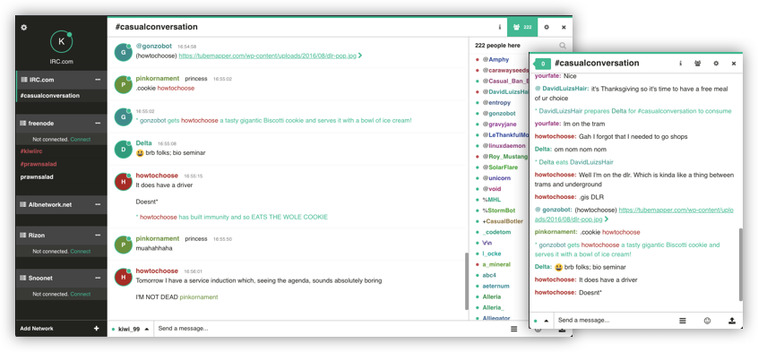

<!--
Важно: этот README был автоматически сгенерирован <https://github.com/YunoHost/apps/tree/master/tools/readme_generator>
Он НЕ ДОЛЖЕН редактироваться вручную.
-->

# KiwiIRC для YunoHost

[](https://ci-apps.yunohost.org/ci/apps/kiwiirc/)


[](https://install-app.yunohost.org/?app=kiwiirc)

*[Прочтите этот README на других языках.](./ALL_README.md)*

> *Этот пакет позволяет Вам установить KiwiIRC быстро и просто на YunoHost-сервер.*  
> *Если у Вас нет YunoHost, пожалуйста, посмотрите [инструкцию](https://yunohost.org/install), чтобы узнать, как установить его.*

## Обзор

A versatile web based messenger using IRC

### Features:

- For single networks, bouncer hosts, or a personal generic IRC client that remembers your networks
- Works out of the box with a default IRC network - or use your own
- Single or multiple IRC network connections
- Light and dark modes
- Desktop notifications
- Extremely versatile via a single JSON config file at runtime


**Поставляемая версия:** 1.7.1~ynh2

**Демо-версия:** <https://kiwiirc.com/nextclient>

## Снимки экрана



## Документация и ресурсы

- Официальный веб-сайт приложения: <https://kiwiirc.com/>
- Официальная документация администратора: <https://github.com/kiwiirc/kiwiirc/wiki>
- Репозиторий кода главной ветки приложения: <https://github.com/kiwiirc/kiwiirc>
- Магазин YunoHost: <https://apps.yunohost.org/app/kiwiirc>
- Сообщите об ошибке: <https://github.com/YunoHost-Apps/kiwiirc_ynh/issues>

## Информация для разработчиков

Пришлите Ваш запрос на слияние в [ветку `testing`](https://github.com/YunoHost-Apps/kiwiirc_ynh/tree/testing).

Чтобы попробовать ветку `testing`, пожалуйста, сделайте что-то вроде этого:

```bash
sudo yunohost app install https://github.com/YunoHost-Apps/kiwiirc_ynh/tree/testing --debug
или
sudo yunohost app upgrade kiwiirc -u https://github.com/YunoHost-Apps/kiwiirc_ynh/tree/testing --debug
```

**Больше информации о пакетировании приложений:** <https://yunohost.org/packaging_apps>
